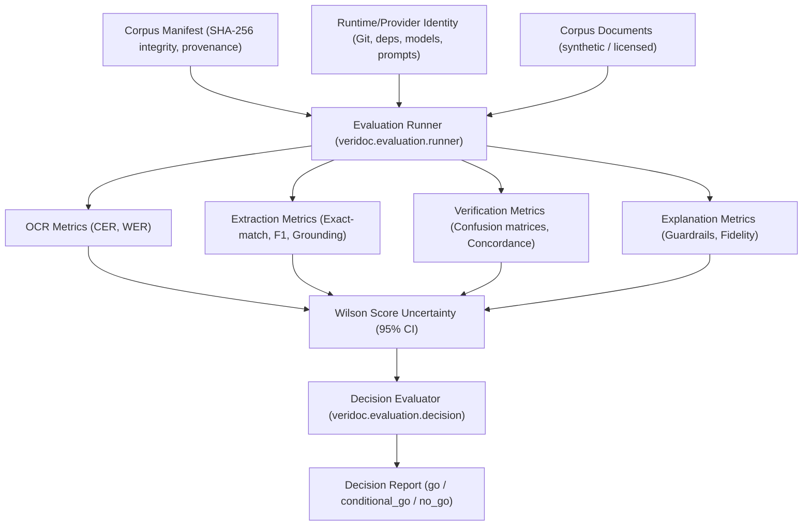
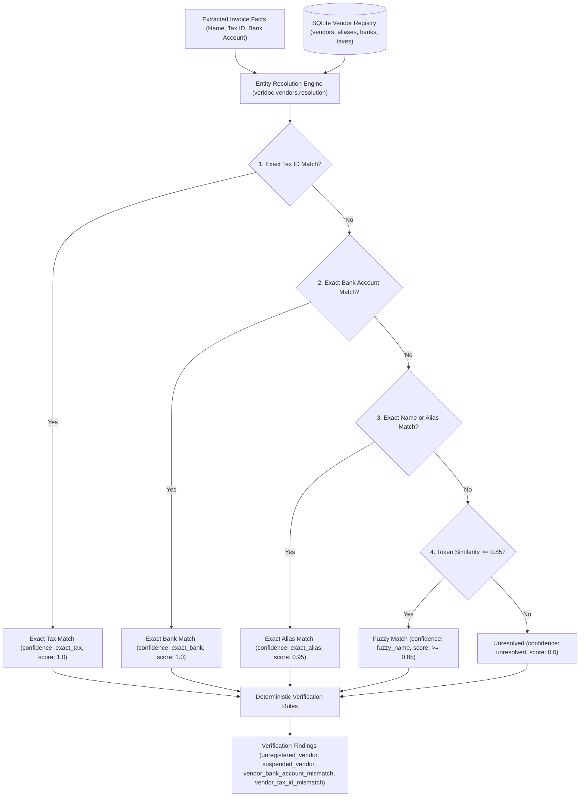

# Architecture

Veridoc's document-processing boundary accepts one bounded invoice or
purchase-order image/PDF, runs OCR, and returns typed extraction data with
page-level evidence and explicit uncertainty. It also provides local SQLite
reference persistence, deterministic verification services, and an internal
evidence-grounded explanation layer. `POST /process` now orchestrates those
stages into a typed final response and `GET /review` provides a minimal local
review page. Phase 8 adds bearer-token-protected local reference-data CRUD and
bounded atomic import plus online backup and stopped-service atomic restore.
Phase 9 adds a per-actor authenticated human review workflow: an immutable
processing snapshot and append-only event history per case, in a dedicated
local SQLite store, behind session cookies, CSRF protection, and
role-scoped authorization. Phase 10 adds reproducible container packaging,
proxy-terminated TLS guidance, local loopback isolation for reference-data
administration, OCR engine readiness probing (`GET /ready`), deployment rate
and concurrency limiting, pre-decode upload scanning and quarantine, automated
backup retention via `veridoc-backup`, and operational telemetry export
(`GET /metrics`). Phase 11 adds a preregistered evaluation protocol, synthetic
corpus governance, slice-level metrics, runtime/provider drift detection, a
deterministic evaluation runner, threshold-driven decision evaluation, and the
`veridoc-evaluate` CLI. Phase 12 adds an authoritative vendor master registry,
multi-attribute entity resolution, and deterministic remit-to bank account and tax
verification rules. Remote identity providers, distributed databases, and
multi-region infrastructure remain outside the scope.

## System boundary

Veridoc is scoped to invoice and purchase-order reconciliation. It is not a
generic document platform, identity/KYC system, training pipeline, accounting
system of record, or autonomous payment approver.

```mermaid
flowchart LR
    Client["HTTP multipart client"] --> Context["Request correlation"]
    Context --> App["FastAPI application"]
    Context --> RequestLog["Metadata-only request log"]
    App --> Validate["Bounded upload validation"]
    Validate --> ProcessGraph["Typed complete processing graph at POST /process"]
    ProcessGraph --> OCR
    Validate --> Temp["Private temporary file"]
    Temp --> Decode["PNG/JPEG decode or PDF rasterization"]
    Decode --> OCR["OCREngine protocol"]
    OCR --> Tesseract["Tesseract adapter"]
    Tesseract --> Raw["OCRResponse at POST /ocr"]
    Tesseract --> Bundle["OCR text plus in-memory PNG pages"]
    Bundle --> Graph["Typed LangGraph extraction node"]
    Graph --> Extractor["StructuredExtractor protocol"]
    Extractor --> OpenAI["OpenAI Responses adapter"]
    OpenAI --> Typed["InvoiceExtraction at POST /extract"]
    Typed --> VerifyGraph["Typed LangGraph verification node"]
    VerifyGraph --> Verify["VerificationService"]
    Verify --> Repository["InvoiceRepository protocol"]
    SQLite["SQLite reference adapter"] --> Repository
    Verify --> Findings["VerificationResult"]
    Findings --> ExplainGraph["Typed LangGraph explanation node"]
    ExplainGraph --> Explain["ExplanationService"]
    Explain --> Fallback["Deterministic renderer"]
    Explain --> Explainer["FindingExplainer protocol"]
    Explainer --> ExplainOpenAI["OpenAI Responses adapter"]
    Explain --> Explanations["ExplanationResult"]
    Explain --> Verdict["Deterministic verdict node"]
    Verdict --> Processed["ProcessingResult"]
    Reviewer["Local reviewer"] --> Review["GET /review"]
    Review --> ProcessGraph
    Admin["Local reference-data administrator"] --> AdminAuth["Bearer token boundary"]
    AdminAuth --> AdminAPI["Admin CRUD and bounded import router"]
    AdminAPI --> AdminProtocol["ReferenceDataAdminRepository protocol"]
    AdminProtocol --> SQLite
    Import["At most 1 MiB and 500 records"] --> AdminAPI
    Operator["Stopped-service operator"] --> Maintenance["veridoc-reference backup or restore"]
    Maintenance --> SQLite
    Migrations["Forward-only migration ledger"] --> SQLite
    ReviewActor["Review actor (reviewer / review_admin)"] --> ReviewConsole["GET /review/console"]
    ReviewActor --> ReviewSession["Session + CSRF boundary"]
    ReviewConsole --> ReviewSession
    ReviewSession --> ReviewAPI["Review case router"]
    ReviewAPI --> ProcessGraph
    ReviewAPI --> ReviewRepo["ReviewCaseReader / ReviewCaseWriter protocol"]
    ReviewRepo --> ReviewSQLite["Dedicated review SQLite store"]
    ReviewOperator["Stopped-service operator"] --> ReviewMaintenance["veridoc-review backup or restore"]
    ReviewMaintenance --> ReviewSQLite
    ReviewMigrations["Forward-only review migration ledger"] --> ReviewSQLite
```



The outer ASGI boundary limits complete document, import, and administration
mutation request bodies before parsing, even without `Content-Length`.
Route-relative matching keeps those limits active under ASGI mounts and
configured root paths. Document decoding and inspection run in a worker thread,
then validation and upload closure finish before OCR, provider, processing, or
repository dependency construction. Rasterization and OCR also run in worker
threads, as does multimodal provider-payload assembly and its base64 expansion.
Bounded reference-import JSON parsing and its SQLite transaction run in worker
threads as separate steps. Validated bytes use a private temporary directory
only during processing; page images are normalized in memory, with the remaining
document bundle budget enforced during each PNG write, and are not retained
after the request.

## Package boundaries

- `veridoc.app` owns FastAPI routes, request correlation, dependency injection,
  and safe HTTP error translation for `/ocr`, `/extract`, and `/process`.
- `veridoc.ingestion` bounds uploads, validates signatures and decoded limits,
  sanitizes filenames, and manages private temporary uploads.
- `veridoc.ocr` decodes validated documents, invokes the replaceable OCR engine,
  and can return OCR text paired with normalized PNG pages.
- `veridoc.extraction.models` owns strict Pydantic invoice, line-item, evidence,
  uncertainty, and confidence schemas. Optional fields remain optional.
- `veridoc.extraction.protocol` defines the provider-neutral async
  `StructuredExtractor` boundary and validates page/image alignment.
- `veridoc.extraction.graph` compiles the typed Phase 2 graph:
  `START -> extract -> END`.
- `veridoc.extraction.service` composes OCR, the typed extraction request, and
  the graph without importing FastAPI or the OpenAI SDK.
- `veridoc.extraction.openai_responses` implements the protocol with OCR text,
  rendered page images, structured parsing, and safe provider failure mapping.
- `veridoc.persistence.protocol` defines the invoice and purchase-order
  reference-data boundary; `veridoc.persistence.sqlite` implements it with local
  SQLite tables.
- `veridoc.administration` owns bounded CRUD/import schemas, the shared-token
  authentication policy, the administration repository protocol, FastAPI router,
  and local maintenance CLI. It never accepts or returns document content.
- `veridoc.persistence.migrations` owns the ordered SQLite schema ledger;
  `veridoc.persistence.schema` validates required tables, columns, keys,
  constraints, and provenance indexes; `veridoc.persistence.maintenance` owns
  non-mutating, integrity-checked online backup and validated atomic restore.
- `veridoc.verification` owns strict findings, pure arithmetic/history/PO
  comparison rules, an API-neutral service, and a typed single-node verification
  graph. Verification imports the repository protocol, not SQLite connection
  code.
- `veridoc.explanation` owns strict explanation result and provider-draft
  schemas, a deterministic renderer, provider-draft validation, an API-neutral
  service, and a typed single-node explanation graph. It receives verification
  findings, not OCR or document data.
- `veridoc.explanation.openai_responses` implements the optional provider
  boundary. It can propose short guidance only; application code retains the
  canonical finding and renders all numerical context.
- `veridoc.processing` owns the typed complete graph, its API-neutral service,
  final result contract, and deterministic review verdict. It orchestrates
  approved stages but does not implement their domain rules.
- `veridoc.review.page` renders the no-build local `/review` demo page. It
  submits to the public processing endpoint and never stores a document or
  review decision; it is unrelated to the Phase 9 workflow below.
- `veridoc.review.models` owns the strict, `extra="forbid"` review domain
  schemas: actor/case/event identifiers, the digest-verified `ReviewSnapshot`,
  the append-only `ReviewEvent`, and the per-mutation request/idempotency
  models. It imports `veridoc.processing.models` for the snapshot's
  `ProcessingResult` payload and nothing FastAPI- or SQLite-specific.
- `veridoc.review.transitions` owns the deterministic case-status transition
  table and role/assignee authorization rules as pure functions; it does not
  touch storage.
- `veridoc.review.protocol` defines the `ReviewCaseReader`/`ReviewCaseWriter`/
  `ReviewSessionStore` boundaries and the safe domain errors (data
  unavailable, stale version, idempotency conflict, authorization denied).
- `veridoc.review.auth` and `veridoc.review.config` own credential
  comparison, session issuance/verification, CSRF token generation, and
  environment-sourced actor-file/origin/store configuration.
- `veridoc.review.persistence` implements the protocols against a dedicated
  local SQLite database: `sqlite.py` (repository), `migrations.py` and
  `schema.py` (mirroring `veridoc.persistence`'s pattern independently, per
  ADR 0009), `maintenance.py` (backup/restore), and `cli.py` (the
  `veridoc-review` console script).
- `veridoc.review.api` owns the authenticated FastAPI router: session,
  case, and console routes, auth-before-storage dependency ordering, and
  safe HTTP error translation for every review-specific domain error.
- `veridoc.review.console_page` renders the no-build browser console that
  drives `veridoc.review.api`'s routes.
- `veridoc.deployment` owns rate and concurrency limiting middleware, readiness
  probing, operational telemetry, and the `veridoc-backup` maintenance CLI.
- `veridoc.evaluation` owns the offline and benchmark evaluation subsystem:
  `models.py` (strict Pydantic schemas for manifests, slices, metrics, and
  decision reports), `manifest.py` (integrity, provenance, and anti-leakage
  validation), `metrics/` (OCR CER/WER, extraction EM/F1/grounding, verification
  rule confusion and concordance, explanation guardrail violation), `identity.py`
  (artifact and provider identity capture with soft/hard drift classification),
  `runner.py` (deterministic execution with Wilson score confidence intervals),
  `decision.py` (threshold-driven go/conditional_go/no_go report generator),
  and `cli.py` (the `veridoc-evaluate` command-line entry point).

## Typed extraction flow

`OCRService.process_with_page_images` produces an `OCRDocumentBundle` containing
the typed OCR result and one numbered in-memory PNG image per OCR page.
`ExtractionRequest` rejects nonmatching page sequences. The graph's
`ExtractionState` is a `TypedDict` with a required request and optional typed
`InvoiceExtraction` output; no node exchanges a loose undocumented dictionary.
The OCR boundary rejects malformed engine page results and retains only finite
confidence values from 0 through 100 before computing its aggregate.

The response supports invoice/purchase-order/unknown classification, nullable
header fields, nullable line-item values, confidence values, evidence keyed by
field name, and explicit uncertainty. `ocr_confidence` is calculated by the OCR
boundary and overrides any provider-supplied value. `extraction_confidence` is a
provider-reported signal, not a calibrated probability or verification verdict.
Quantities and amounts are bounded to 24 digits and 6 decimal places before
verification arithmetic. Evidence is deliberately limited to page number,
OCR-or-image source, and an optional text span. The graph rejects nonexistent
pages and requires each supplied OCR span to occur on its referenced page after
Unicode, case, and whitespace normalization. Stable bounding-box coordinates
are not an implemented contract.

## Typed verification flow

`VerificationService` accepts an `InvoiceExtraction` and an `InvoiceRepository`.
It returns a `VerificationResult` containing one structured finding per failed
deterministic rule, rather than an opaque score. Findings carry observed and
expected values or ranges, comparison source, rule, severity, and historical
statistics when applicable. The typed `VerificationState` graph is
`START -> verify -> END` and is separate from Phase 2 extraction orchestration.

The service checks arithmetic, invoice-date ordering, duplicate invoice numbers
(canonicalized, so OCR and provider variants of one number share one
identity), purchase-order headers and line items, vendor total/line-item
history, line-item occurrence, and consistently observed payment terms. It
uses a minimum of three same-currency observations for statistical
comparisons and reports `insufficient_history` instead of treating smaller
samples as reliable. Purchase orders act as authorization ceilings: invoice
totals and line quantities at or below the authorized values pass, amounts
above flag, unit prices still require exact equality, and prior invoices
against the same PO plus the current total must not exceed the PO total
(cumulative split-billing ceiling). See
[ADR 0026](decisions/0026-one-sided-po-ceilings-and-normalized-duplicates.md).

## Typed explanation flow

`ExplanationService` accepts a `VerificationResult` and produces an
`ExplanationResult` with one `FindingExplanation` per finding. Each explanation
always carries the original typed finding and deterministic numerical context
rendered only from that finding's observed value, expected value or range,
sample size, mean, standard deviation, and z-score.

The typed `ExplanationState` graph is `START -> explain -> END`. Its optional
`FindingExplainer` receives the canonical findings alone and may propose a
short action-oriented narrative. The service accepts a provider result only
when it covers every finding exactly once and contains no numeric, comparative,
or negated factual claim. Otherwise, including provider unavailability or
malformed structured output, it returns the deterministic explanation instead.

## Typed complete processing flow

`ProcessingService` accepts one `ValidatedUpload` and invokes a typed
`ProcessingState` graph: `START -> ocr -> extract -> verify -> explain ->
verdict -> END`. The graph reuses the Phase 2, Phase 3, and Phase 4 typed
graphs rather than reimplementing extraction, verification, or explanation
logic.

`ProcessingResult` returns the `InvoiceExtraction` (including its page-level
evidence), ordered canonical findings, ordered explanations, and a
`ProcessingVerdict`. A verdict is `review_required` whenever at least one
finding exists; otherwise it is `clear`, meaning only that no deterministic
finding requires review. It is not an approval, payment decision, or guarantee
that the document is trustworthy. See [ADR 0005](decisions/0005-use-review-required-processing-verdicts.md).

## Phase 9 review workflow

A review case is created by running the same typed processing graph
`POST /process` uses — both routes depend on the identical
`veridoc.processing.dependencies.get_processing_service` composition, so
they cannot silently diverge — and storing its `ProcessingResult` as a
`ReviewSnapshot`: a schema-versioned, SHA-256
content-digested, immutable copy. The digest is recomputed and checked on
every read (`hydrate_review_snapshot`), so a case's evidence, findings, and
verdict can never silently drift from what the pipeline actually produced —
including across a later change to the reference database a case's finding
depended on at creation time.

### State machine

```text
            create_case
                |
                v
          [unassigned] --assign_case (self-claim)--> [assigned]
                ^                                        |  |
                |                                        |  +--assign_case (reassign, reason required)--> [assigned]
                +----------escalate_case----------- [escalated]
                                                          |
                                                     decide_case
                                                          v
                                                      [decided]  (terminal)
```

`veridoc.review.transitions` encodes this table as pure data
(`_ALLOWED_TRANSITIONS`), separate from the authorization rule that decides
*who* may drive a given transition (`authorize_operation`): a `reviewer` may
only self-claim from `unassigned` or `escalated`, and may only escalate or
decide a case currently assigned to them; a `review_admin` may perform every
operation on every case. Every mutation appends exactly one `ReviewEvent`
(never edits a prior one) and increments the case version by exactly one, so
a case's full history is always the ordered replay of its events, not a
mutable row.

### Concurrency, idempotency, and recovery

Every mutation carries the case's `expected_version`; the repository applies
it as `UPDATE ... WHERE id = ? AND version = ?`, backed by a
`UNIQUE(case_row_id, case_version)` index as defense in depth, so two
concurrent writers can never silently overwrite each other — the loser gets
`StaleVersionConflictError` before any event is appended. Every mutation also
carries an `Idempotency-Key`; a losing writer that raced on the exact same
key and body replays the winner's result instead of erroring, which requires
rolling back the loser's partial writes before re-checking the stored digest
(see `_resolve_after_idempotency_conflict`). `veridoc.review.persistence.maintenance`
mirrors `veridoc.persistence.maintenance`'s online-backup/atomic-restore
pattern independently for the review store (ADR 0009): because each case
carries its own frozen snapshot, restoring a review backup never requires
reconstructing the historical reference database that was live when a
restored case was created.

### Authentication and CSRF

`veridoc.review.auth.authenticate_actor` scans every configured actor's
stored secret digest with `secrets.compare_digest`, without
short-circuiting on the first match, so response timing does not reveal
which actor (if any) owns a presented credential. A successful exchange
issues an opaque session token; only its SHA-256 digest, actor ID, creation
time, expiry, and revocation time are ever persisted. The session cookie is
`HttpOnly`/`Secure`/`SameSite=Strict`; a separate non-`HttpOnly` CSRF cookie
pairs with an `X-CSRF-Token` header (double-submit pattern) and an exact
`Origin` check, both required before any state-changing dependency —
including the untrusted document upload and the processing pipeline it
would run — is resolved. `require_review_actor`, `require_origin_match`, and
`require_csrf_protection` compose as FastAPI dependencies ahead of every
mutating route parameter, matching the auth-before-storage ordering already
used for administration (ADR 0006, ADR 0008).

See [ADR 0008](decisions/0008-use-local-actor-file-and-http-only-sessions-for-review.md),
[ADR 0009](decisions/0009-use-immutable-versioned-review-records.md), and
[ADR 0010](decisions/0010-defer-automated-review-retention-and-purge.md).

### Auditor evidence export

`veridoc.review.evidence` binds one canonical case rendering — identifiers,
status, version, attribution, timestamps, the complete digest-verified
snapshot, and the full ordered event history — under a canonical SHA-256
bundle digest (`EvidenceBundle`). `GET /review/cases/{case_id}/evidence`
requires the same actor authentication as case detail and records the
exporting actor on the bundle; `veridoc-review export` writes the same
bundle from the dedicated store, and `veridoc-review verify-bundle` checks
it with no store access. Verification re-parses the schema, recomputes the
snapshot digest against its embedded result, replays event-chain continuity
(contiguous versions from `case_created`, matching case identifiers,
timestamps, and status) and transition legality through the same pure
transition table the repository enforces, then recomputes the bundle
digest. Export and verification are read-only: no route, CLI command, or
console control edits a case or an event. See
[ADR 0025](decisions/0025-auditor-evidence-export-for-review-cases.md).

## Dependency direction

```text
FastAPI route --> extraction service --> typed graph and protocols
                                              ^
                                              |
                         OCR and OpenAI adapters implement boundaries

verification service --> repository protocol <-- SQLite adapter

admin API --> authentication --> administration repository protocol <-- SQLite adapter
    |
    +--> bounded import validation --> one SQLite transaction

maintenance CLI --> SQLite online backup / migrated atomic restore

explanation service --> finding-explainer protocol <-- OpenAI adapter
                       |
                       +--> deterministic renderer

processing service --> processing graph --> extraction, verification, and explanation graphs
review page --> POST /process

review session/CSRF boundary --> review case router --> processing service (same graph as /process)
review case router --> ReviewCaseReader/Writer protocol <-- review SQLite adapter
review console page --> review case router (fetch only, no server-rendered document content)
review maintenance CLI --> review SQLite online backup / migrated atomic restore
review evidence router/CLI --> canonical case detail --> offline bundle verification (read-only)
```

API code does not implement extraction or verification rules. The extraction,
explanation, and processing services do not import FastAPI or an OpenAI SDK.
Verification and explanation domain logic must not import FastAPI, LangGraph,
SQLite connection code, or vendor SDKs.

## Planned evolution boundaries

The [project roadmap](roadmap.md) describes later candidates without approving
their implementation. If those phases are approved, they must extend the
current boundaries rather than bypass them:

- a remote identity provider or production TLS/deployment profile must
  preserve the actor attribution and session-secrecy properties Phase 9
  already defines (ADR 0008), not replace them with a weaker shared secret;
- automated retention/purge, when built, must operate on the
  `retention_until` column Phase 9 already reserves without requiring a
  storage migration (ADR 0010); and
- evaluation must report OCR/extraction quality separately from deterministic
  verification-rule coverage and end-to-end operational performance.

Phase 9 is implemented as described above. Phases 10 through 13 and Phase 15
are complete; Phase 14 is planned but blocked on a Tesseract-equipped
operator environment, and Phase 16 is in progress. See the
[project roadmap](roadmap.md) for the current phase status.

## External boundaries

### OCR

Tesseract remains the version 1 OCR baseline behind `OCREngine`. It receives one
decoded Pillow image and returns typed page text plus optional aggregate word
confidence. See [ADR 0001](decisions/0001-use-tesseract-for-v1.md) for its
installation, Arabic/Latin configuration, and limitations.

### Structured extraction

`OpenAIResponsesExtractor` is configured with `OPENAI_API_KEY` and
`VERIDOC_LLM_MODEL` when `/extract` is called. It passes labeled OCR text and
high-detail in-memory PNG page images through the Responses API's Pydantic
structured-parsing path with response storage disabled. The adapter returns a
typed result, or raises a safe unavailable/invalid-output error. Its
request-scoped provider client closes during dependency teardown, and the
provider call has a bounded 120-second application deadline. See
[ADR 0002](decisions/0002-use-openai-responses-for-phase-2.md).

The adapter is replaced in tests with a fake implementation. Tests never need
credentials, network access, or a Tesseract executable.

### Persistence and verification

`SQLiteInvoiceRepository` applies numbered forward-only migrations for vendor
invoices, purchase orders, line items, and administrative metadata. Amounts are
stored as text and recreated as `Decimal`; dates and timestamps use ISO-8601
text. `POST /process` and the administration adapter open the path in
`VERIDOC_REFERENCE_DATABASE`, defaulting to `veridoc-reference.sqlite3`.
SQLite and unsupported-schema failures map to a safe unavailable error.
Initialization also validates declared column types, current primary keys,
required `NOT NULL` columns, child foreign keys, purchase-order natural
uniqueness, managed record/provenance indexes, and unique child parent/position
indexes, and rejects triggers on managed tables before committing the migration
transaction. Rejected
initialization therefore leaves the prior schema, migration ledger, and rows
unchanged.
Already-current schemas take a read-only validation path; pending migrations
acquire a write reservation and re-read their ledger under that lock.
Compound reads hold one SQLite snapshot so pagination counts, parent records,
and child line items remain coherent during concurrent administration writes.
Migration 4 makes each child position unique within its parent and lets ordered
line-item hydration use the same composite index.
Both the verification-facing and administration write paths canonicalize vendor
keys and enforce the same bounded invoice, purchase-order, and line-item schema
before persistence. Reads reconstruct and revalidate that same contract,
including administrative metadata, and translate invalid stored rows to the
repository's safe unavailable error.

The separate `ReferenceDataAdminRepository` protocol exposes bounded pages,
provenance-preserving CRUD, and one-transaction imports. Provenance identity is
`source` plus `external_id` within each record type. A server `record_id` and
creation/update timestamps are application managed. Optional retention dates
are metadata only; no background deletion service exists.

`veridoc-reference` performs online backup and stopped-service restore without
an HTTP database export. Both destination replacements refuse live WAL, SHM,
or rollback-journal sidecars; restore applies the same guard to its source
backup, and neither operation can write to a path named as its source's
sidecar. Online backup safely snapshots a live source. Backup preserves the
live source and published snapshot at their original schema version while
migrations, structural checks, and full persisted-row validation run on a
disposable copy and commit together only after every check succeeds. Restore
validates the source, migrates a temporary sibling database under the same
transactional schema and semantic checks, validates database and foreign-key
integrity again, and atomically replaces the destination. See
[ADR 0003](decisions/0003-use-sqlite-for-phase-3-reference-data.md) and
[ADR 0007](decisions/0007-use-forward-only-sqlite-migrations.md).

Administration authentication uses a dedicated 32-256 character token from
`VERIDOC_ADMIN_TOKEN`, not an OpenAI credential. The application compares the
presented Bearer value in constant time and never logs it. This is a shared local
secret without users or roles; see
[ADR 0006](decisions/0006-use-bearer-token-for-local-administration.md).

Verification rules are deterministic Python code. Statistical findings use
Decimal mean, population standard deviation, and z-score calculations; they do
not call an LLM or ask one to recalculate values.

### Explanations

`OpenAIResponsesExplainer` uses the same `OPENAI_API_KEY` and
`VERIDOC_LLM_MODEL` configuration when an injected explanation service elects
to use it. It sends only serialized `VerificationFinding` values and disables
response storage. The model returns structured narrative drafts, never an
authoritative finding or numerical calculation. The application validates each
draft and deterministically falls back when it is unsafe, incomplete, invalid,
or unavailable, then closes any configured request-scoped provider client. The
provider call has the same bounded 120-second application deadline. See
[ADR 0004](decisions/0004-use-validated-llm-proposals-for-explanations.md).

The explanation graph has no standalone HTTP endpoint; `POST /process` delivers
its canonical explanations together with the extraction, findings, and verdict.

## Failure handling and data safety

Upload validation rejects malformed, encrypted/repaired, oversized, unsupported,
or type-mismatched documents before OCR. OCR unavailability maps to HTTP 503 and
processing failures map to HTTP 422. Extraction configuration/provider failures
map to `extraction_unavailable` (503); missing or invalid structured provider
output maps to `extraction_processing_failed` (422). A provider timeout maps to
`extraction_unavailable` (503). Reference-data failures map
to `reference_data_unavailable` (503), and an incomplete orchestration result
maps to `processing_failed` (422). Public errors never expose paths, stack
traces, credentials, document bytes, raw OCR text, or provider responses.

Administration rejects missing or incorrect credentials uniformly, bounds JSON
imports before parsing, validates all records before beginning the write
transaction, and rolls the transaction back on rejected conflicts. Responses
contain reference facts and provenance only. Backup/restore failures use one
generic local maintenance error rather than exposing a filesystem path.

The current implementation does not log document bodies, OCR text, extracted
fields, rendered pages, credentials, verification findings, or temporary paths.
Extraction provider calls send only the current request's OCR text and
normalized page images. Explanation provider calls send canonical verification
findings only; neither provider adapter retains a response through the request
it makes.

## Evaluation and readiness decision architecture

Phase 11 introduces a decoupled, deterministic evaluation and benchmarking
pipeline to measure extraction, OCR, verification, and explanation performance
against preregistered acceptance thresholds ([ADR 0018](decisions/0018-preregistered-evaluation-protocol-and-thresholds.md),
[ADR 0019](decisions/0019-provider-identity-capture-and-drift-triggers.md),
[ADR 0020](decisions/0020-corpus-governance-and-synthetic-manifest-schema.md)).



The evaluation runner operates independently of the FastAPI server. It
evaluates documents across declared slices (language, scan quality, layout,
vendor) and enforces minimum slice sample thresholds. Binomial proportions
use Wilson score intervals at 95% confidence to quantify measurement
uncertainty. The decision evaluator compares observed lower confidence bounds
against preregistered gates to determine production readiness. Any detected
hard drift in the provider or runtime artifact triggers an automatic `no_go`
or `conditional_go` outcome requiring re-evaluation.

## Authoritative vendor registry and entity resolution

Phase 12 introduces an authoritative vendor master registry and entity resolution
engine to combat invoice redirection fraud ([ADR 0021](decisions/0021-vendor-master-registry-and-schema.md),
[ADR 0022](decisions/0022-multi-attribute-vendor-entity-resolution.md),
[ADR 0023](decisions/0023-deterministic-vendor-and-bank-reconciliation-rules.md)).



The cascading engine deterministically resolves incoming invoices against registered
vendor master entities. Remit-to bank coordinates are strictly reconciled against
the resolved vendor's registered accounts; any discrepancy generates a high-severity
`vendor_bank_account_mismatch` finding, triggering human review and a prominent
warning banner in the review console.

## Operational observability

The FastAPI middleware assigns a safe request ID before route handling, returns
it as `X-Request-ID`, and emits one `veridoc.request` completion record. The
record includes the ID, method, static route template (or `<unmatched>`), status
code, and duration only; it never includes path parameters or query text. The
header may carry a bounded safe client correlation value, but
does not identify a document, reviewer, or approval decision. `GET /health` is
a liveness signal for the HTTP application. `GET /ready` probes OCR executable,
language data (`eng` and `ara`), and database schemas. When enabled by
`VERIDOC_METRICS_ENABLED=1`, `GET /metrics` exports a structured JSON snapshot
of request, limit, and upload scan counters with sensitive fields strictly redacted.

## Current tradeoffs and limitations

- OCR text and images are combined to preserve layout context that plain text
  alone loses, at the cost of sending document data to the configured provider.
- The complete graph composes existing one-node stage graphs and adds no hidden
  workflow state or separate background queue.
- Pydantic structured parsing rejects malformed provider output instead of
  attempting an OCR-only or heuristic fallback.
- While Phase 3 used extracted vendor names as purely syntactic lookup keys,
  Phase 12 resolves authoritative vendor master entities through cascading
  multi-attribute matching (tax, bank, alias, fuzzy) and reconciles remit-to
  bank accounts deterministically. Fuzzy matching uses an evidence-grounded
  0.85 threshold; dynamic machine-learning entity resolution is outside
  version 1 scope.
- Explanation-provider prose is deliberately constrained. Any invalid, unsafe,
  or unavailable provider output yields a deterministic result rather than an
  unsupported claim.
- The product behavior completed through Phase 6 has one synchronous processing
  endpoint and a stateless local review page. Phase 7 adds no runtime feature;
  Phase 8 adds local shared-token reference-data administration only. Phase 9
  adds a per-actor authenticated, persistent review record with an immutable
  snapshot and append-only event history, but only two roles, a local
  operator-managed actor file (no self-registration, password reset, or
  remote directory integration), and no automated purge or case-deletion route.
  Phase 10 adds container packaging, reverse-proxy TLS termination guidance,
  loopback administration isolation, rate and concurrency limiting, pre-decode
  upload quarantine, readiness probing, automated backup retention, and
  operational telemetry export. Phase 11 completes evaluation protocol definition,
  runner execution, drift monitoring, and readiness decision reporting.
  Evaluation results apply only to the tested artifact profile; external provider
  changes invalidate `go` determinations and require protocol re-execution.
- Phase 12 adds authoritative vendor master data persistence, cascading entity
  resolution, and deterministic bank account/tax ID reconciliation rules, but
  deliberately excludes remote enterprise ERP synchronization, automated ACH/wire
  execution, external banking APIs, or dynamic ML classifiers.
