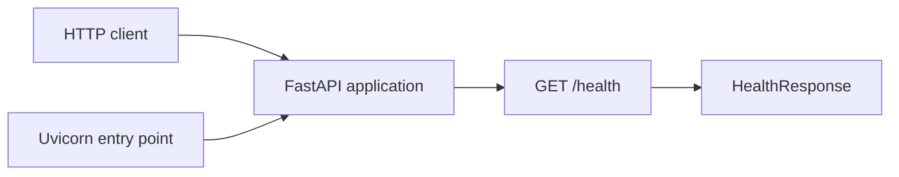
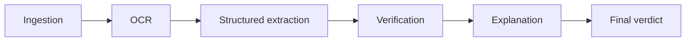

# Architecture

This document distinguishes the implemented Phase 0 scaffold from the approved
version 1 direction. A component labeled **planned** does not exist yet and must
not be implemented before its phase is approved.

## System boundary

Veridoc's version 1 boundary is invoice and purchase-order reconciliation. The
system will accept an invoice, extract facts, compare those facts with purchase
orders and vendor history, calculate deterministic findings, explain the
evidence, and return a verdict.

It is not a generic document platform, identity/KYC system, training pipeline,
accounting system of record, or autonomous payment approver.

## Implemented Phase 0 architecture



The current code has one package and no external I/O:

- `veridoc.__main__` starts Uvicorn for local use.
- `veridoc.app` owns the FastAPI object, typed health model, and health route.
- `GET /health` returns a constant Pydantic response and does not probe future
  OCR, LLM, or database services.
- tests call the ASGI application in process and verify application metadata,
  behavior, and the OpenAPI response reference.

The health route is synchronous because it performs no I/O. Async functions
should be introduced only for genuinely I/O-bound boundaries.

## Approved future processing flow

The main workflow will use LangGraph after the relevant phases are approved.
Each meaningful stage will be a node:



The graph itself, LangGraph dependency, state type, and nodes are not present in
Phase 0.

## Dependency direction

Future layers must depend inward toward typed domain contracts:

```text
HTTP API and LangGraph orchestration
                |
                v
       domain services and models
                ^
                |
OCR, LLM, and persistence adapters implementing boundary protocols
```

Rules:

- domain calculations do not import FastAPI, LangGraph, SQLite connection code,
  or vendor SDKs;
- graph nodes coordinate typed inputs and outputs but do not hide business rules;
- API code translates HTTP requests and responses rather than implementing
  verification;
- persistence implementations own database connections and SQLite-specific SQL;
  and
- OCR and LLM clients remain replaceable behind typed boundaries.

Do not create empty layers or protocols before an approved feature needs them.

## Typed state and schemas

`HealthResponse` is the only implemented API schema. The invoice schema and
graph state begin in Phase 2.

The future graph state must use a documented `TypedDict`, dataclass, or Pydantic
model. It should carry typed stage outputs and explicit errors or uncertainty;
nodes must not exchange an undocumented loose dictionary. Optional invoice
fields remain optional rather than being fabricated to satisfy a schema.

Public API schemas and internal graph state may differ. HTTP concerns belong at
the API boundary; deterministic domain values and evidence should remain usable
without FastAPI.

## External boundaries

### OCR boundary — planned for Phase 1

Tesseract is the selected version 1 baseline, but no OCR package, executable,
interface, or runtime configuration exists in Phase 0. Before integration,
Phase 1 must add an ADR covering the Arabic and Latin fit, installation,
confidence behavior, layout limitations, and rejected alternative. The adapter
must return typed text, page, confidence, and error information without leaking
engine details into ingestion or API code.

Only one OCR engine belongs in version 1.

### LLM boundary — planned for Phase 2

A vision-capable LLM will handle document classification, invoice field
extraction, layout interpretation, and evidence mapping. It must be injected
behind a typed client boundary, configured from the environment, and mocked in
tests. No model client or API key is configured in Phase 0.

The LLM may interpret layouts and explain already-computed evidence. It must not
invent missing fields or recalculate arithmetic and statistics.

### Persistence boundary — planned for Phase 3

SQLite will store purchase-order data, invoice identifiers, and synthetic vendor
history behind a repository interface. Verification code must depend on that
interface rather than SQLite connections or SQL. A later PostgreSQL adapter
should not require domain-logic changes.

No database file, schema, migration, repository, or connection exists in Phase
0.

## Deterministic verification — planned for Phase 3

Arithmetic consistency, duplicate detection, purchase-order comparisons, dates,
historical summaries, standard deviations, and z-scores must be calculated in
code. Every finding will carry structured evidence and an explicit
insufficient-history outcome when the sample is too small.

The explanation layer may phrase those results but may not change or independently
recompute them. Veridoc will not expose only an opaque anomaly score.

## Failure handling

Phase 0 has no document I/O or external dependency failure modes. FastAPI and
Uvicorn own basic startup and request logging, and the health route has no
expected error response.

As boundaries are approved, each must translate failures into safe typed errors,
log the processing stage with a correlation identifier, distinguish retryable
external failures, and avoid secrets, paths, stack traces, or document contents
in public responses. Upload reads must be bounded before expensive parsing and
temporary files must be cleaned up deterministically.

## Current tradeoffs

- The response model lives beside the single route. Splitting an API schema
  package before more schemas exist would add structure without benefit.
- The health check reports process availability only. It intentionally does not
  claim that unimplemented downstream services are ready.
- No application configuration or logging framework is added because Phase 0
  has no setting or document-processing boundary to configure.
- HTTPX exercises the ASGI app directly, keeping the suite fast while preserving
  meaningful serialization and routing coverage.

## Intentionally not implemented

Phase 0 contains no uploads, file validation, PDF/image decoding, OCR, LangGraph,
invoice schema, VLM integration, SQLite persistence, purchase-order data,
anomaly detection, explanations, complete processing endpoint, or review UI.
These omissions enforce the approved phase boundary rather than representing
hidden capabilities.
