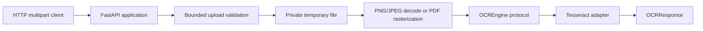
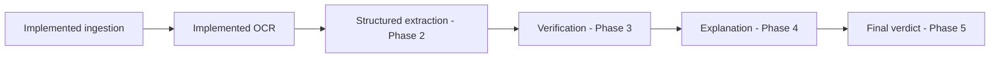

# Architecture

This document distinguishes the implemented Phase 1 upload/OCR boundary from
later planned work. A component labeled **planned** does not exist yet and must
not be implemented before its phase is approved.

## System boundary

Veridoc's version 1 boundary is invoice and purchase-order reconciliation. The
implemented Phase 1 slice accepts one bounded invoice image or PDF, validates it,
rasterizes pages when needed, and returns raw OCR text and confidence. It does
not yet extract fields, compare purchase orders, calculate findings, explain
evidence, or return a verdict.

Veridoc is not a generic document platform, identity/KYC system, training
pipeline, accounting system of record, or autonomous payment approver.

## Implemented Phase 1 architecture



The current package boundaries are:

- `veridoc.app` owns the FastAPI object, health route, `/ocr` route, dependency
  injection, and safe HTTP error translation.
- `veridoc.ingestion.validation` reads uploads in bounded chunks, checks PDF,
  PNG, and JPEG signatures against the declared type, sanitizes display names,
  and enforces byte, page, dimension, and pixel limits.
- `veridoc.ingestion.storage` writes validated bytes to a private temporary
  directory and removes the file and directory on every exit path.
- `veridoc.ocr.service` renders PDF pages or converts raster images to RGB and
  sends one page at a time to the injected OCR protocol.
- `veridoc.ocr.protocol` defines the replaceable engine and safe failure types.
- `veridoc.ocr.tesseract` adapts pytesseract data into typed text and aggregate
  word confidence without exposing engine details to the API.
- `veridoc.ocr.models` defines internal page/document values and the public
  `OCRResponse` schema.

Validation is deliberately completed before expensive decoding or OCR. The
service does not retain documents after a request and does not log document
bytes, OCR text, local temporary paths, or engine output.

## Planned processing flow

After explicit phase approval, later stages will extend the current boundary:



LangGraph is not installed or integrated in Phase 1. It belongs to the approved
structured-extraction and later workflow phases.

## Dependency direction

Future layers must depend inward toward typed domain contracts:

```text
HTTP API and future LangGraph orchestration
                    |
                    v
        domain services and typed models
                    ^
                    |
OCR, LLM, and persistence adapters implementing protocols
```

Rules:

- upload validation and OCR adapters do not implement invoice verification;
- domain calculations must not import FastAPI, LangGraph, SQLite connection
  code, or vendor SDKs;
- API code translates HTTP requests and responses rather than implementing
  extraction or anomaly rules;
- external OCR, LLM, and persistence clients remain replaceable behind typed
  boundaries; and
- do not create empty layers or protocols before an approved feature needs them.

## Typed state and schemas

Phase 1 implements `ValidatedUpload`, `OCRPageResult`,
`OCRDocumentResult`, `OCRPage`, and `OCRResponse`. The response carries raw page
text and optional confidence only; it is not an invoice schema. Typed invoice
fields and graph state begin in Phase 2.

The future graph state must use a documented `TypedDict`, dataclass, or Pydantic
model. It should carry typed stage outputs and explicit errors or uncertainty;
nodes must not exchange an undocumented loose dictionary. Optional invoice
fields remain optional rather than being fabricated to satisfy a schema.

## External boundaries

### OCR boundary — implemented in Phase 1

Tesseract is the selected version 1 baseline. `OCREngine` accepts one decoded
Pillow image and returns typed page text and optional word-confidence aggregate.
The adapter reads `TESSERACT_CMD` and `TESSERACT_LANG`, serializes access to the
pytesseract executable configuration, and maps missing executables or language
data to `ocr_unavailable`. See [ADR 0001](decisions/0001-use-tesseract-for-v1.md)
for the choice, installation, Arabic/Latin guidance, and limitations.

Only one OCR engine belongs in version 1. Tesseract confidence is not a
calibrated probability and must not become a verification verdict.

### LLM boundary — planned for Phase 2

A vision-capable LLM will handle document classification, invoice field
extraction, layout interpretation, and evidence mapping. It must be injected
behind a typed client boundary, configured from the environment, and mocked in
tests. No model client or API key is configured in Phase 1.

### Persistence boundary — planned for Phase 3

SQLite will store purchase-order data, invoice identifiers, and synthetic vendor
history behind a repository interface. Verification code must depend on that
interface rather than SQLite connections or SQL. No database file, schema,
migration, repository, or connection exists in Phase 1.

## Failure handling

Upload reads are bounded before validation. Signature mismatches, unsupported
types, malformed documents, encrypted or repaired PDFs, excessive pages, and
oversized decoded images become safe structured HTTP errors. Validated bytes and
decoded page images are ephemeral and cleaned deterministically.

OCR executable or language-data failures become HTTP 503 with
`ocr_unavailable`. Rendering or unexpected processing failures become HTTP 422
with `ocr_processing_failed`. Public errors never expose paths, stack traces,
secrets, raw documents, or OCR engine output.

## Current tradeoffs

- Tesseract is smaller and easier to install than PaddleOCR for the first
  replaceable baseline, but it is sensitive to scan quality, skew, layout, and
  trained-data availability.
- PyMuPDF rasterizes PDF pages at a fixed 150 DPI so the OCR engine sees one
  stable Pillow image type; vector text semantics are intentionally not used.
- Upload validation uses content signatures and decoded dimensions in addition
  to client metadata; filenames are display-only and never trusted as paths.
- The endpoint returns raw OCR rather than inventing structured invoice fields;
  field extraction and verification remain separate approved phases.

## Intentionally not implemented

Phase 1 contains no LangGraph graph, typed invoice schema, vision-capable LLM,
SQLite persistence, purchase-order data, anomaly detection, explanation layer,
complete processing verdict, authentication, request-correlation middleware,
malware scanning, retention service, or review UI.
