# Architecture

Veridoc's implemented Phase 2 boundary accepts one bounded invoice or
purchase-order image/PDF, runs OCR, and returns typed extraction data with
page-level evidence and explicit uncertainty. Verification, explanations, and
verdicts remain later phases.

## System boundary

Veridoc is scoped to invoice and purchase-order reconciliation. It is not a
generic document platform, identity/KYC system, training pipeline, accounting
system of record, or autonomous payment approver.

```mermaid
flowchart LR
    Client["HTTP multipart client"] --> App["FastAPI application"]
    App --> Validate["Bounded upload validation"]
    Validate --> Temp["Private temporary file"]
    Temp --> Decode["PNG/JPEG decode or PDF rasterization"]
    Decode --> OCR["OCREngine protocol"]
    OCR --> Tesseract["Tesseract adapter"]
    Tesseract --> Raw["OCRResponse at POST /ocr"]
    Tesseract --> Bundle["OCR text plus in-memory PNG pages"]
    Bundle --> Graph["Typed LangGraph extraction node"]
    Graph --> Extractor["StructuredExtractor protocol"]
    Extractor --> OpenAI["OpenAI Responses adapter"]
    OpenAI --> Typed["InvoiceExtraction at POST /extract"]
```



Validation finishes before expensive decoding, OCR, or external model work.
Validated bytes use a private temporary directory only during processing; page
images are normalized in memory and are not retained after the request.

## Package boundaries

- `veridoc.app` owns FastAPI routes, dependency injection, and safe HTTP error
  translation for `/ocr` and `/extract`.
- `veridoc.ingestion` bounds uploads, validates signatures and decoded limits,
  sanitizes filenames, and manages private temporary uploads.
- `veridoc.ocr` decodes validated documents, invokes the replaceable OCR engine,
  and can return OCR text paired with normalized PNG pages.
- `veridoc.extraction.models` owns strict Pydantic invoice, line-item, evidence,
  uncertainty, and confidence schemas. Optional fields remain optional.
- `veridoc.extraction.protocol` defines the provider-neutral async
  `StructuredExtractor` boundary and validates page/image alignment.
- `veridoc.extraction.graph` compiles the typed Phase 2 graph:
  `START -> extract -> END`.
- `veridoc.extraction.service` composes OCR, the typed extraction request, and
  the graph without importing FastAPI or the OpenAI SDK.
- `veridoc.extraction.openai_responses` implements the protocol with OCR text,
  rendered page images, structured parsing, and safe provider failure mapping.

## Typed extraction flow

`OCRService.process_with_page_images` produces an `OCRDocumentBundle` containing
the typed OCR result and one numbered in-memory PNG image per OCR page.
`ExtractionRequest` rejects nonmatching page sequences. The graph's
`ExtractionState` is a `TypedDict` with a required request and optional typed
`InvoiceExtraction` output; no node exchanges a loose undocumented dictionary.

The response supports invoice/purchase-order/unknown classification, nullable
header fields, nullable line-item values, confidence values, evidence keyed by
field name, and explicit uncertainty. `ocr_confidence` is calculated by the OCR
boundary and overrides any provider-supplied value. `extraction_confidence` is a
provider-reported signal, not a calibrated probability or verification verdict.
Evidence is deliberately limited to page number, OCR-or-image source, and an
optional text span. Stable bounding-box coordinates are not an implemented
contract.

## Dependency direction

```text
FastAPI route --> extraction service --> typed graph and protocols
                                              ^
                                              |
                         OCR and OpenAI adapters implement boundaries
```

API code does not implement extraction rules. The extraction service does not
import FastAPI or the OpenAI SDK. Later verification domain logic must not
import FastAPI, LangGraph, SQLite connection code, or vendor SDKs.

## External boundaries

### OCR

Tesseract remains the version 1 OCR baseline behind `OCREngine`. It receives one
decoded Pillow image and returns typed page text plus optional aggregate word
confidence. See [ADR 0001](decisions/0001-use-tesseract-for-v1.md) for its
installation, Arabic/Latin configuration, and limitations.

### Structured extraction

`OpenAIResponsesExtractor` is configured with `OPENAI_API_KEY` and
`VERIDOC_LLM_MODEL` when `/extract` is called. It passes labeled OCR text and
high-detail in-memory PNG page images through the Responses API's Pydantic
structured-parsing path with response storage disabled. The adapter returns a
typed result, or raises a safe unavailable/invalid-output error. See
[ADR 0002](decisions/0002-use-openai-responses-for-phase-2.md).

The adapter is replaced in tests with a fake implementation. Tests never need
credentials, network access, or a Tesseract executable.

### Persistence — planned for Phase 3

SQLite will store purchase-order data, invoice identifiers, and synthetic vendor
history behind a repository interface. No database file, schema, migration,
repository, or connection exists in Phase 2.

## Failure handling and data safety

Upload validation rejects malformed, encrypted/repaired, oversized, unsupported,
or type-mismatched documents before OCR. OCR unavailability maps to HTTP 503 and
processing failures map to HTTP 422. Extraction configuration/provider failures
map to `extraction_unavailable` (503); missing or invalid structured provider
output maps to `extraction_processing_failed` (422). Public errors never expose
paths, stack traces, credentials, document bytes, raw OCR text, or provider
responses.

The current implementation does not log document bodies, OCR text, extracted
fields, rendered pages, credentials, or temporary paths. Provider calls send
only the current request's OCR text and normalized page images.

## Current tradeoffs and limitations

- OCR text and images are combined to preserve layout context that plain text
  alone loses, at the cost of sending document data to the configured provider.
- A one-node LangGraph establishes a typed extraction boundary without adding
  unapproved verification or workflow behavior.
- Pydantic structured parsing rejects malformed provider output instead of
  attempting an OCR-only or heuristic fallback.
- Phase 2 contains no vendor identification, purchase-order comparison, SQLite
  persistence, arithmetic checks, anomaly detection, explanation layer, final
  verdict, authentication, request correlation, malware scanning, retention
  service, or review UI.
